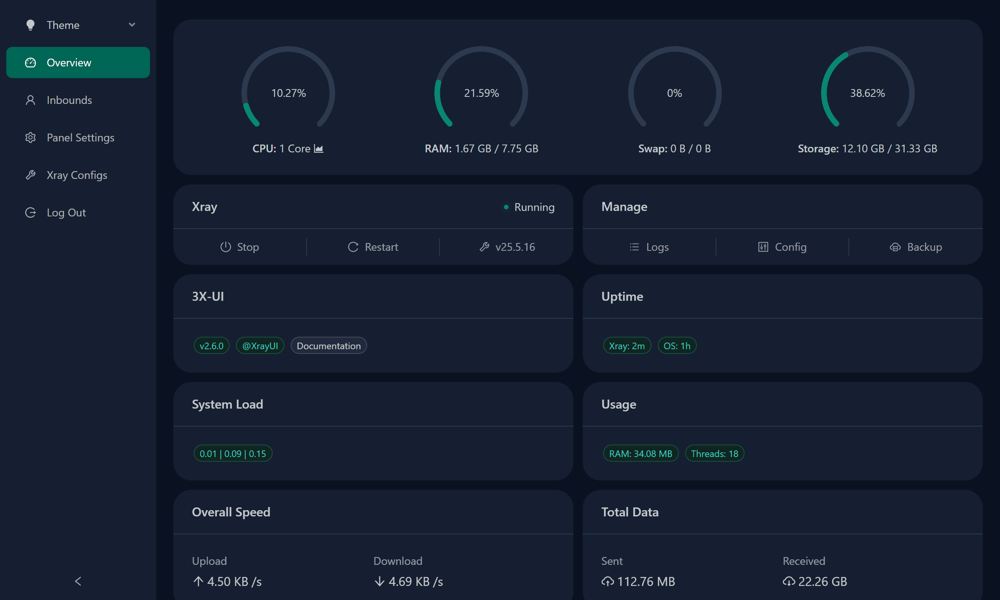

<!--
N.B.: This README was automatically generated by <https://github.com/YunoHost/apps_tools/blob/main/readme_generator>
It shall NOT be edited by hand.
-->

<h1>
  
  3x-ui, packaged for YunoHost
</h1>

Web panel for Xray

[?style=for-the-badge)](https://ci-apps.yunohost.org/ci/apps/3x-ui/)

<div align="center">
<a href="https://apps.yunohost.org/app/3x-ui"></a>
<a href="https://github.com/YunoHost-Apps/3x-ui_ynh/issues"></a>
</div>


## Screenshots


## 📦 Developer info

[](https://ci-apps.yunohost.org/ci/apps/3x-ui/)

🛠️ Upstream 3x-ui repository: <https://github.com/MHSanaei/3x-ui>

Pull request are welcome and should target the [`testing` branch](https://github.com/YunoHost-Apps/3x-ui_ynh/tree/testing).

The `testing` branch can be tested using:
```
# fresh install:
sudo yunohost app install https://github.com/YunoHost-Apps/3x-ui_ynh/tree/testing

# upgrade an existing install:
sudo yunohost app upgrade 3x-ui -u https://github.com/YunoHost-Apps/3x-ui_ynh/tree/testing
```

You can also switch to the testing branch to update from testing by default (as same as for APT when you chose to use a testing repos) with this command:
```bash
sudo yunohost app setting 3x-ui upgrade_channel -v testing
```

### 📚 App packaging documentation

Please see <https://doc.yunohost.org/dev/packaging/> for more information.- fresh install;
- remove + reinstall;
- backup + restore;
- upgrade to a newer release.

## Development

Typical flow:

```bash
git init
git checkout -b testing
git add .
git commit -m "Initial 3x-ui YunoHost package"
```

Useful checks:

```bash
yunohost app install ./3x-ui_ynh
systemctl status 3x-ui
journalctl -u 3x-ui -n 100 --no-pager
```

## License

This packaging repository is distributed under GPL-3.0.
The upstream application 3x-ui is also distributed under GPL-3.0.
